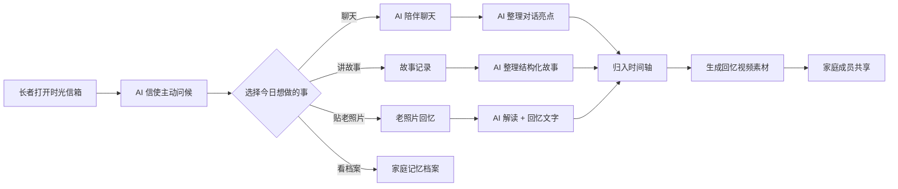

# AI 时光信箱 — 产品需求文档（PRD）

## 1. 产品概述

《AI 时光信箱》是一款面向老年用户及其家庭的 AI 陪伴应用，致力于帮助长者用最自然的方式（说话、贴照片、聊天）记录人生故事，并把散落的家庭记忆凝结成可传承的"时光档案"。

- **目标用户**：60 岁以上长者（主记录人）+ 子女/孙辈（家庭成员协同浏览）
- **核心痛点**：老人不会用复杂工具；子女没时间整理；家庭记忆正在流失
- **产品价值**：用 AI 把"讲述"变成"作品"，让每个普通家庭都拥有一本会说话的家书

## 2. 核心功能

### 2.1 用户角色

| 角色 | 进入方式 | 核心权限 |
|------|----------|----------|
| 长者（主记录人） | 默认登录 | 讲述、上传、聊天、查看时间轴 |
| 家庭成员 | 共享档案 | 浏览、点赞、留言、接收更新 |

### 2.2 功能模块

1. **首页（时光信箱主页）**：温暖欢迎、信箱隐喻、五大功能入口、今日问候
2. **AI 陪伴聊天**：温暖 AI 主动提问、引导分享、表情与情绪反馈
3. **故事记录**：文字输入 / 语音录制 → AI 整理成结构化人生故事
4. **老照片回忆**：上传老照片 → AI 解读画面 → 生成温暖回忆文字
5. **回忆视频生成**：聚合照片 + 故事 + 语音 → 一段家庭回忆短视频（预览）
6. **家庭记忆档案（时间轴）**：按人生阶段展示重要节点，可点开详情

### 2.3 页面详情

| 页面名称 | 模块名称 | 功能描述 |
|----------|----------|----------|
| 首页 | 信箱封面 | 大标题、当日问候、AI 信使形象、功能入口卡片 |
| 首页 | 今日记忆 | 展示一条"X 年前的今天"随机记忆 |
| AI 陪伴聊天 | 对话流 | 气泡式聊天，AI 主动发起、引导追问 |
| AI 陪伴聊天 | 话题推荐 | 底部话题气泡，如"童年最难忘的味道" |
| AI 陪伴聊天 | 情绪反馈 | AI 据情绪给出温暖回应与表情 |
| 故事记录 | 输入区 | 大号文字框 + 语音录制按钮（带波形） |
| 故事记录 | AI 整理结果 | 把口述整理为标题/段落/关键词，可保存 |
| 老照片回忆 | 上传区 | 拖拽/点击上传，老照片滤镜预览 |
| 老照片回忆 | AI 解读 | 画面描述 + 暖色回忆文字 + 年代推测 |
| 回忆视频生成 | 素材聚合 | 选择照片/故事/语音时间轴片段 |
| 回忆视频生成 | 视频预览 | 模拟播放器，配字幕与音乐标识 |
| 家庭记忆档案 | 人生时间轴 | 童年/求学/工作/家庭/旅行/晚年分段 |
| 家庭记忆档案 | 节点详情卡 | 弹出卡片：照片 + 故事 + 留言 |

## 3. 核心流程

### 3.1 故事记录主流程

长者打开应用 → AI 信使主动问候 → 长者选择"讲个故事" → 文字/语音口述 → AI 整理成结构化故事 → 长者确认保存 → 自动归入时间轴对应阶段 → 同步给家庭成员。

### 3.2 老照片回忆流程

上传老照片 → AI 识别画面元素与年代 → 生成温暖回忆文字 → 长者补充记忆 → 保存到时间轴 → 可选进入"回忆视频"素材库。

### 3.3 流程图

## 4. 用户界面设计

### 4.1 设计风格

- **整体气质**：温暖的"信箱 + 老相册"质感，怀旧但不老旧；现代排版 + 暖色纸质纹理
- **主色调**：
  - 背景：暖米黄 `#F8F1E5`（信纸色）
  - 主色：深赭石 `#B5673E`（旧邮戳、漆封）
  - 辅色：墨绿 `#5E7A6B`（信箱铜绿）
  - 点缀：暮金 `#D9A441`（夕阳）
  - 文字：暖棕黑 `#3A2A22`
- **按钮风格**：大圆角（16px+）、厚实立体感、温暖投影、≥56px 高度（老年友好）
- **字体**：
  - 中文标题：`ZCOOL XiaoWei`（书法风骨、温暖）
  - 中文正文：`Noto Serif SC`（衬线、阅读舒适）
  - 数字/英文：`DM Serif Display` + `Source Serif Pro`
- **字号**：正文 ≥ 18px，标题 ≥ 28px，关键操作 ≥ 22px（老年友好）
- **布局**：卡片式 + 大留白，顶部主导航，单页聚焦一件事
- **图标/插画**：lucide-react 线性图标 + 暖色填充；信封、邮票、相册、铜铃等意象
- **动画**：信封开合、相片翻面、时间轴流淌；柔和缓动，避免眩晕

### 4.2 页面设计概览

| 页面名称 | 模块名称 | UI 元素 |
|----------|----------|----------|
| 首页 | 信箱封面 | 大标题居中、邮戳印章动效、暖色光晕背景、信使吉祥物 |
| 首页 | 功能入口卡 | 5 张大卡片（聊天/故事/照片/视频/档案），悬停浮起 |
| AI 陪伴聊天 | 对话气泡 | AI 左侧暖色卡、用户右侧暮金卡，头像 + 时间戳 |
| 故事记录 | 语音录制 | 大圆形录音按钮，录音时显示声波环 |
| 老照片回忆 | 老相册框 | 邮票齿边相框，照片轻微旋转贴在卡纸上 |
| 回忆视频 | 视频预览 | 16:9 模拟播放器，胶片划痕、暖色滤镜叠加 |
| 家庭记忆档案 | 时间轴 | 竖向时间线 + 节点照片缩略图，悬停展开详情 |

### 4.3 响应式

- 桌面优先（≥1024px）保证排版与时间轴舒展
- 平板（768–1024px）功能卡两列
- 移动端（<768px）单列大字、底部固定主导航
- 所有可点击区域 ≥ 48px，触摸友好

### 4.4 3D 场景

本项目不使用 3D 场景，以 2.5D 邮票/相册纸艺质感呈现温暖氛围。
