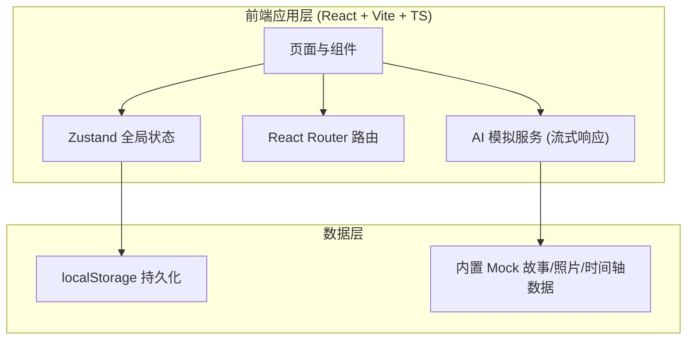
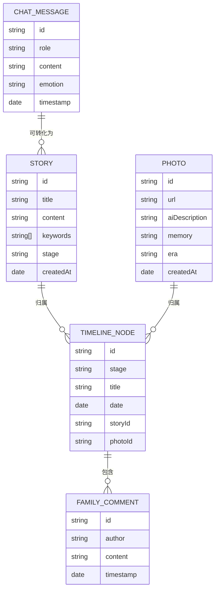

# AI 时光信箱 — 技术架构文档

## 1. 架构设计

本项目为纯前端 Demo（无后端服务），AI 交互通过前端模拟流式响应来呈现完整的用户体验流程，便于大赛展示。



## 2. 技术说明

- **前端框架**：React 18 + TypeScript + Vite
- **样式方案**：Tailwind CSS 3 + 自定义 CSS 变量（暖色主题 token）
- **状态管理**：Zustand（聊天记录、故事库、时间轴、照片库）
- **路由**：react-router-dom v6
- **图标**：lucide-react
- **持久化**：localStorage（演示用，刷新不丢失）
- **AI 模拟**：前端定时器 + 预设语料库，模拟流式打字与思考延迟，呈现真实 AI 交互感
- **后端**：无（Demo 性质，便于一键运行展示）

## 3. 路由定义

| 路由 | 页面名称 | 用途 |
|------|----------|------|
| `/` | 首页 | 信箱封面、功能入口、今日问候 |
| `/chat` | AI 陪伴聊天 | 与 AI 信使对话，引导记忆分享 |
| `/story` | 故事记录 | 文字/语音输入 → AI 整理结构化故事 |
| `/photos` | 老照片回忆 | 上传照片 → AI 解读 + 回忆文字 |
| `/video` | 回忆视频生成 | 聚合素材 → 生成回忆短视频预览 |
| `/timeline` | 家庭记忆档案 | 人生时间轴 + 节点详情 |

## 4. AI 模拟服务设计

由于是 Demo，AI 能力通过前端模拟实现，但保留真实的交互节奏：

### 4.1 AI 陪伴聊天

- 预设话题库（童年味道、第一份工作、初恋、最难忘的旅行…）
- AI 主动发起 + 根据用户输入关键词追问
- 流式打字效果（每字 30–60ms）
- 情绪识别（关键词匹配：开心/难过/思念）→ 不同回应模板

### 4.2 故事记录 AI 整理

- 输入：长文本口述
- 输出：自动生成标题、分段、关键词、人生阶段标签
- 模拟"思考"动画（2–3 秒）后流式输出整理结果

### 4.3 老照片 AI 解读

- 输入：图片文件（任意图片）
- 输出：画面描述 + 年代推测 + 温暖回忆文字（基于文件名/随机语料）
- 模拟"识别中"进度条 + 流式输出

### 4.4 回忆视频生成

- 输入：选定的照片 + 故事片段
- 输出：模拟视频播放器（CSS 动画 + 字幕轮播 + 配乐标识）
- 模拟"生成进度"0–100%

## 5. 数据模型

### 5.1 数据模型定义



### 5.2 数据定义（前端 TypeScript 类型）

```typescript
// 人生阶段
type LifeStage = '童年' | '求学' | '工作' | '家庭' | '旅行' | '晚年';

// 故事
interface Story {
  id: string;
  title: string;
  content: string;
  keywords: string[];
  stage: LifeStage;
  createdAt: string;
}

// 老照片
interface Photo {
  id: string;
  url: string;            // base64 或 blob url
  aiDescription: string;
  memory: string;
  era: string;
  createdAt: string;
}

// 聊天消息
interface ChatMessage {
  id: string;
  role: 'ai' | 'user';
  content: string;
  emotion?: 'happy' | 'sad' | 'nostalgic' | 'neutral';
  timestamp: string;
}

// 时间轴节点
interface TimelineNode {
  id: string;
  stage: LifeStage;
  title: string;
  date: string;
  storyId?: string;
  photoId?: string;
  comments: FamilyComment[];
}

// 家庭留言
interface FamilyComment {
  id: string;
  author: string;
  content: string;
  timestamp: string;
}
```

### 5.3 初始 Mock 数据

应用首次启动时注入 3–5 条预设故事、2–3 张占位老照片、6–8 条时间轴节点，让档案页与时间轴"开箱即有内容"，体现产品已完成态。新增内容会通过 Zustand + localStorage 持续累积。
